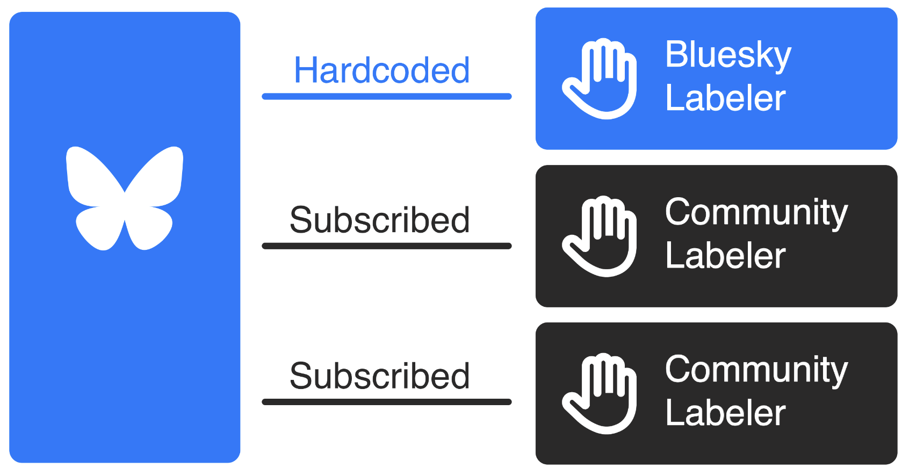

Tradiční platformy operují s **centralizovanými systémy moderace obsahu**, což mnohdy vede k&nbsp;neprůhlednosti a
nespokojenosti uživatelů. Dalším rizikem je **náhlá změna pravidel** v důsledku změny vlastníka nebo politiky platformy.

[Bluesky](https://bsky.app) naopak prosazuje otevřenou a **decentralizovanou moderaci** obsahu. Díky tomu může každý
uživatel, vývojář nebo organizace vytvořit **vlastní systém moderace obsahu**, který bude respektovat jeho hodnoty a
pravidla.

Hlavním prvkem moderace obsahu jsou **labelers** (štítkovače), kteří označují dostupný příspšvky podle předem
definovaných pravidel. Uživatelé poté rozhodnou, zda označený obsah chtějí _blokovat_, _skrývat_ nebo _zobrazovat_.

[Bluesky Labeler](https://bsky.app/profile/moderation.bsky.app), je pevnou součástí aplikace a pomáhá prosazovat
základní pravidla platformy - ostatní jsou vytvářeny komunitou.

## Komunitní moderace

Komunitních labelerů existuje celá řada. Jednotlivé **labelers** (štítkovače) můžete sledovat a&nbsp;**odebírat**
podobně jako sledujete uživatele. Štítkovače vám pomohou očistit vaši timeline od&nbsp;obsahu, který na Bluesky nechcete
vidět (trolly, [Alfa](https://bsky.app/profile/skywatch.blue), [AI obrázky](https://bsky.app/profile/aimod.social), fake
news, atd.).

:::tip[Kde štítkovače najdu?]
Seznam komunitních štítkovačů https://www.bluesky-labelers.io
:::

Chcete se dozvědět více o Bluesky a jeho moderaci? Podívejte se
na [oficiální dokumentaci](https://docs.bsky.app/blog/blueskys-moderation-architecture) k&nbsp;moderaci obsahu.

## Zajímavé labelery

- [Kraje v Česku labeler](https://bsky.app/profile/czkraje.bsky.social) - označuje příspěvky podle krajů v Česku.

## Další informace

- [Můj první Bluesky labeler](https://matejvi.cz/vyvoj/muj-prvni-bluesky-labeler/)