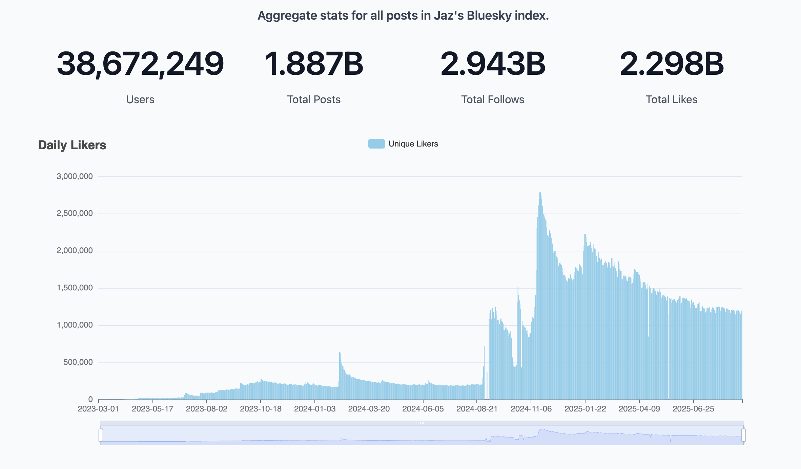

### Kolik má Bluesky uživatelů?

Nejrelevantnější informace a základní statistikách získáte na webu https://bsky.jazco.dev/stats. Tento web spravuje
[@jaz.bsky.social](https://bsky.app/profile/jaz.bsky.social), člen core týmu Bluesky. Vetšina ostatních nástrojů čerpá
data z tohoto webu.

Živé počítadlo uživatelů najdete najdete zde https://bcounter.nat.vg nebo zde https://bsky-users.theo.io/.

### Kdo má nejvíce sledujících?

Statistiky nejsledovanějších účtů najdete na webu https://bstat.app. Nejvíce sledujících má samozřejmě profil
[@bsky.app](https://bstat.app/profile/bsky.app). Mezi hvězdné účty patří například herec
[George Takei](https://bsky.app/profile/georgetakei.bsky.social) nebo spisovatel
[Neil Gaiman](https://bsky.app/profile/neilhimself.neilgaiman.com) či
[Stephan King](https://bsky.app/profile/stephenking.bsky.social).

### České statistiky

České statistiky najdete na webu https://stats.bsky.cz. Tento web spravuje [@bsky.cz](https://bsky.app/profile/bsky.cz)

[Více informací o českých statistikách](/projekty/ceske-statistiky)

### Jaké domény jsou nejpopulárnější?

Které domény nejvyššího řádu jsou na Bluesky nejpopulárnější (samozřejmě to je `.com`)? Zjistíte v katalogu tld
https://blue.mackuba.eu/directory/.
