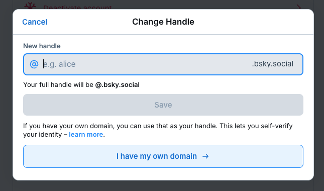
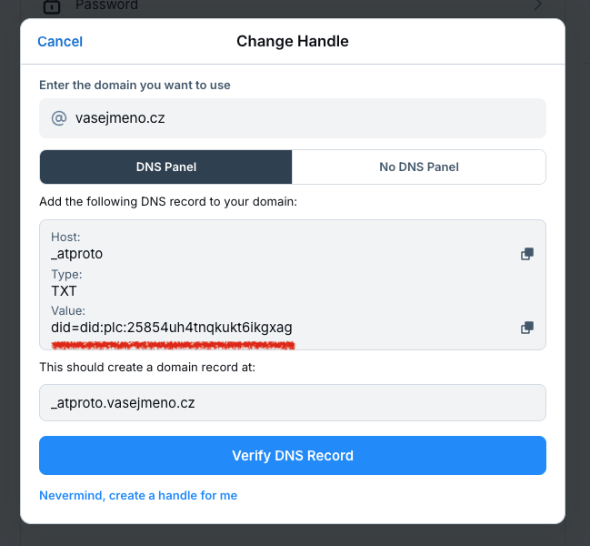
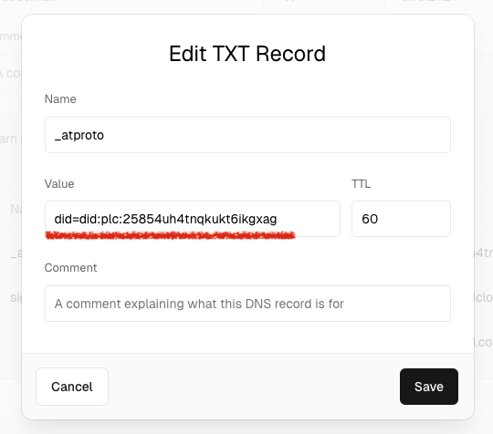

## Co je to handle?

Handle je vaše **unikátní uživatelské jméno** (přezdívka) - které vás na platformě reprezentuje. Na rozdíl od jiných
sociálních sítí však Bluesky přináší jedinečný přístup: můžete si vytvořit handle nejen ve standardním formátu
`@uzivatelskejmeno.bsky.social`, ale také **využít vlastní doménu**.

Díky vlastní doméně můžete mít na Bluesky **unikátní handle**, který nikdo jiný nemůže **podvrhnout nebo ukrást**.
Zároveň to je výborná forma verifikace vašeho účtu, protože kontrolu nad vlastní doménou máte jen vy.

### Proč si vybrat vlastní doménu?

Příkladem mohou být český [@irozhlas.cz](https://bsky.app/profile/irozhlas.cz) nebo zahraniční
[@cnn.com](https://bsky.app/profile/cnn.com), které tímto jednoznačně potvrzují, že jde o **oficiální účty** těchto
médií.

- Získáte **nezaměnitelný handle**, který nikdo jiný nemůže mít.
- Handle s vlastní doménou je **důvěryhodnější**.
- Nikdo vám nemůže **podvrhnout účet** - vydávat se za vás.

### Nechci doménu registrovat!

Chcete mít na Bluesky hezký handle (přezdívku), ale nechcete si kupovat doménu můžete využít služby
[Vanity](https://vanity.blue/), která zdarma nabízí poměrně hezké subdomény `@<vasejmeno>.[něco].blue`.

Tady v čechách je k dispozici služba https://czesky.online, která nabízí handle ve formátu `@<vasejmeno>.czesky.online`.

## Jak ověřit vlastní doménu?

Nejprve budete potřebovat vlastní doménu, kterou si můžete zakoupit u
[různých registrátorů](https://www.nic.cz/whois/registrars/). Předpokládejme, že máte ve vlastnictví doménu
`vasejmeno.cz` a chcete jí použít jako handle na Bluesky.

1. **Přihlaste se** na svůj účet na Bluesky.
2. Podívejte se do **[Settings > Account](https://bsky.app/settings/account) > Handle**
3. Klikněte na **I have my own domain**. 
4. Zdejte svou doménu `vasejmeno.cz` 
5. Poté se přepněte do **administrace vaší domény** a vytvořte na svém doménovém serveru `TXT` záznam s hodnotou, kterou
   vám Bluesky poskytne:

   - doména: `_atproto`
   - typ záznamu: `TXT`
   - TTL (Time To Live): `60`
   - hodnota (nebo někdy data) `did=did:plc:[vaše hodnota]`

   Váš DNS záznam může vypadat například takto 

6. Vraťte se Bluesky a klikněte na **Verify DNS Record** - tím ověření dokončíte. Změna handle může v závislosti na
   vašem DNS serveru trvat až 24 hodin.

:::tip[Kam dál?]
Podívejte se na tutoriál
[How to verify your Bluesky account](https://bsky.social/about/blog/4-28-2023-domain-handle-tutorial).
:::

#### Jak ověřit nastavení DNS záznamu?

Pro oveření nastavení DNS záznamu můžete použít například nástroj
[DIG od Google](https://toolbox.googleapps.com/apps/dig/#TXT/) nebo [DNS lookup](https://dnslookup.online/txt/). Vypište
si hodnotu `TXT` záznamů vedených pro doménu `_atproto.vasejmeno.cz`. Pokud se zobrazí hodnota
`did=did:plc:[vaše hodnota]` shoduje s tím, co po vás chtěl Bluesky máte pravděpodobně vše nastavené správně.

Další možností je použít nástroj `dig` v příkazové řádce:

```shell
$ dig -t TXT _atproto.vasejmeno.cz
```

konkrétní příklad pro doménu `bsky.cz`:

```shell
$ dig -t TXT _atproto.bsky.cz
```

vygeneruje následující výstup:

```text
; <<>> DiG 9.10.6 <<>> -t TXT _atproto.bsky.cz
;; global options: +cmd
;; Got answer:
;; ->>HEADER<<- opcode: QUERY, status: NOERROR, id: 21393
;; flags: qr rd ra; QUERY: 1, ANSWER: 1, AUTHORITY: 0, ADDITIONAL: 1

;; OPT PSEUDOSECTION:
; EDNS: version: 0, flags:; udp: 512
;; QUESTION SECTION:
;_atproto.bsky.cz.		IN	TXT

;; ANSWER SECTION:
_atproto.bsky.cz.	600	IN	TXT	"did=did:plc:rtlrfotcyulei426noqa6fhn"

;; Query time: 42 msec
;; SERVER: 8.8.8.8#53(8.8.8.8)
;; WHEN: Mon Dec 09 12:29:04 CET 2024
;; MSG SIZE  rcvd: 94
```
