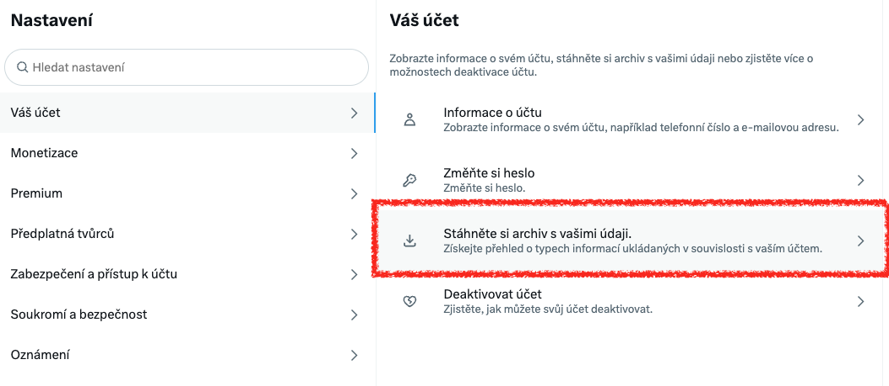
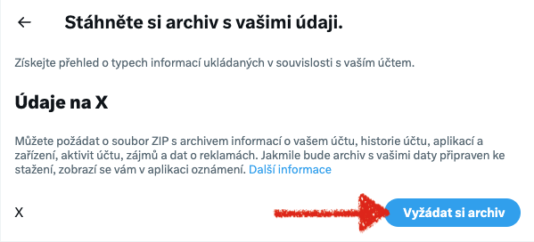
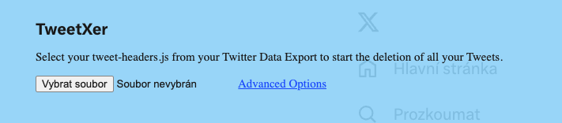

import { Steps } from '@astrojs/starlight/components';

## Proč chceš zrušit Twitter?

Vždy jsem miloval Twitter, byla to moje **nejoblíbenější sociální síť** a jediná, kterou jsem používal roky. Našel jsem
tam spoustu úžasných lidí, skvěle se komunikovalo a bylo snadné sdílet názory. Od chvíle, kdy Twitter
[koupil Elon Musk](https://en.wikipedia.org/wiki/Acquisition_of_Twitter_by_Elon_Musk) a začal zavádět stovky nelogických
a hloupých změn, jsem měl obavy, že zničí mou oblíbenou platformu – a bohužel se to stalo.

- [Twitter použává veškerý váš obsah k trénování AI](https://edition.cnn.com/2024/10/21/tech/x-twitter-terms-of-service/index.html)
- [Twitter uměle zmenšil dosah tweetů](https://www.google.com/search?q=twitter+engagement+dropped)
- [Twitter omezil svobodu projevu](https://www.google.com/search?q=twitter+free+speech)
- [Twitter podporuje extrémisty](https://www.google.com/search?q=twitter+extremists)

## Jak zálohovat Twitter

<Steps>
1. Jděte do **[Nastavení > Váš účet](https://x.com/settings/account) > Stáhněte si archiv s vašimi daty**
   
2. Zadejte heslo a vyberte metodu ověření (email) poté zadejte zaslané **jednorázové heslo**
3. Vyžádejte si archiv a **počkejte na email** 
4. Vyčkejte na email s **odkazem na stažení archivu**
</Steps>

## Vyplatí se promazat staré tweety?

Pokud plánujete svůj účet zcela odstranit, je mazání tweetů **nejspíš zbytečné**. Navíc [existují zvěsti](https://google.com/search?q=delete+tweet+appears+again) o tom, že 
dávno smazané tweety se stejně občas někde objeví.

:::danger[Mažou se skutečně tweety?]
Smazané Tweety jsou technicky „označené” jako smazané, aniž by byly **skutečně
odstraněny z databází** Twitteru/X. Což znamená, že není veřejně viditelný, ale stále někde existuje.
:::

Pokud přesto chcete smazat staré tweety, můžete použít některý z následujících nástrojů:

- [tweetXer](https://github.com/lucahammer/tweetXer) - Open-source nástroj pro smazání tweetů
- [redact.dev](https://redact.dev/services/twitter) - placená služba, aplikace která umožní smazat veškeré tweety
- [tweetdeleter.com](https://tweetdeleter.com) - placená služba pro smazání tweet cena je cca $8 měsíčně

### Jak použít tweetXer

<Steps>
1. Vyžádejte si **[archiv s vašimi daty](https://x.com/settings/account)** rozbalte si získaný archív
2. Přihlašte se do [Twitter](https://twitter.com)
3. Otevřete konzoli přohlížeče (`F12` nebo `Cmd + Option + J` na Macu)
4. Vložte [celý skript](https://raw.githubusercontent.com/lucahammer/tweetXer/main/tweetXer.js) do konzole a stiskněte `Enter`
5. Skript nahoře na stránce přidá modré panel 
6. Klikněte na tlačítko `Vybrat soubor` a nahrajte `tweet-headers.js` nebo `tweets.js` z vašeho archivu
7. Počkejte do smazání **všech svých tweetů** - mazání běží rychlostí cca 5-10 tweetů za sekundu
</Steps>