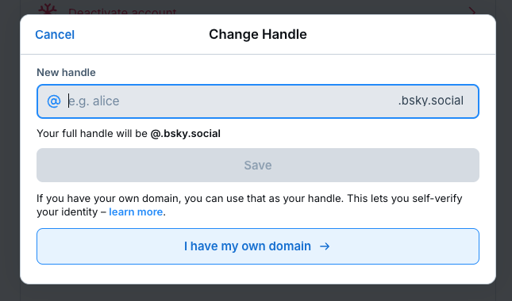
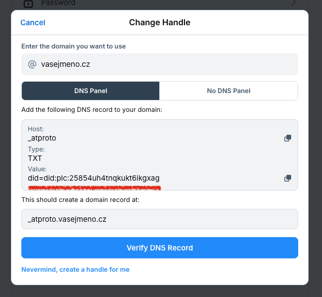
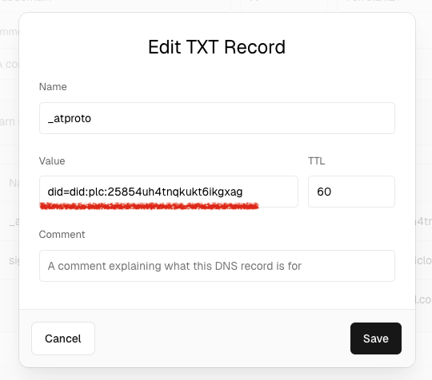

import { Steps } from '@astrojs/starlight/components';

Předpokládejme, že máte ve vlastnictví doménu `vasejmeno.cz` a chcete tuto doménu použít jako [handle](/popis/handle)
(přezdívku) na Bluesky - kdy se `@vasejmeno.cz` stane vaší unikátní přezdívkou.

<Steps>
1. **Přihlaste se** na svůj účet na [webu Bluesky](https://bsky.app).
2. Podívejte se do **[Settings > Account](https://bsky.app/settings/account) > Handle**
3. Klikněte na **I have my own domain**. 
4. Zdejte svou doménu `vasejmeno.cz` 
5. Poté se přepněte do **administrace vaší domény** a vytvořte na svém doménovém serveru `TXT` záznam s hodnotou, kterou
   vám Bluesky poskytne:

   - doména: `_atproto`
   - typ záznamu: `TXT`
   - TTL (Time To Live): `60`
   - hodnota (nebo někdy data) `did=did:plc:[vaše hodnota]`

   Váš DNS záznam může vypadat například takto 

6. Vraťte se Bluesky a klikněte na **Verify DNS Record** - tím ověření dokončíte. Změna handle může v závislosti na
   vašem DNS serveru trvat až 24 hodin.
</Steps>

:::note[Kam dál?]
Podívejte se na tutoriál
[How to verify your Bluesky account](https://bsky.social/about/blog/4-28-2023-domain-handle-tutorial).
:::

### Kontrola nastavení DNS

Pro oveření nastavení DNS záznamu můžete použít například nástroj
[DIG od Google](https://toolbox.googleapps.com/apps/dig/#TXT/) nebo [DNS lookup](https://dnslookup.online/txt/). Vypište
si hodnotu `TXT` záznamů vedených pro doménu `_atproto.vasejmeno.cz`. Pokud se zobrazí hodnota
`did=did:plc:[vaše hodnota]` shoduje s tím, co po vás chtěl Bluesky máte pravděpodobně vše nastavené správně.

Další možností je použít nástroj `dig` v příkazové řádce:

```shell
$ dig -t TXT _atproto.vasejmeno.cz
```

konkrétní příklad pro doménu `bsky.cz`

```shell
$ dig -t TXT _atproto.bsky.cz
```

vygeneruje následující výstup:

```text {13}
; <<>> DiG 9.10.6 <<>> -t TXT _atproto.bsky.cz
;; global options: +cmd
;; Got answer:
;; ->>HEADER<<- opcode: QUERY, status: NOERROR, id: 21393
;; flags: qr rd ra; QUERY: 1, ANSWER: 1, AUTHORITY: 0, ADDITIONAL: 1

;; OPT PSEUDOSECTION:
; EDNS: version: 0, flags:; udp: 512
;; QUESTION SECTION:
;_atproto.bsky.cz.		IN	TXT

;; ANSWER SECTION:
_atproto.bsky.cz.	600	IN	TXT	"did=did:plc:rtlrfotcyulei426noqa6fhn"

;; Query time: 42 msec
;; SERVER: 8.8.8.8#53(8.8.8.8)
;; WHEN: Mon Dec 09 12:29:04 CET 2024
;; MSG SIZE  rcvd: 94
```

## Nemám vlastní doménu, co teď?

Vlastní `.cz` doménu si můžete zaregistrovat u některého z [dostupných registrátorů](https://www.nic.cz/whois/registrars/),
přičemž cena obvykle činí přibližně 250&nbsp;Kč za rok.

Pokud vlastní doménu **nechcete kupovat**, můžete využít třeba služby [Vanity](https://vanity.blue/),
která nabízí oveření handle pomocí subdomény `@<vasejmeno>.[něco].blue` zdarma - snadno tak získáte poměrně atraktivní handle.

Tady v čechách je k dispozici služba https://czesky.online, která nabízí handle ve formátu `@<vasejmeno>.czesky.online`.

## Příjdu o svoji původní přezdívku?

**Ano**, váš původní přezdívka/handle bude uvolněn pro nově registrované účty. Na Bluesky už budete vystupovat pouze pod **svým novým handle**.

:::tip[Záložní účet]
Pokud si přesto přejete svůj původní handle zachovat, vytvořte si ihned po změně handle záložní účet na Bluesky se svým původním handle.
:::

## Přijdu změnou handle o sledující?

**Ne, o své sledující nepřijdete**. Všichni, kdo vás sledují, zůstanou propojeni s vaším účtem i po změně handle.
Automaticky vás budou sledovat pod vaším novým handlem, aniž by museli cokoliv dělat nebo měnit.